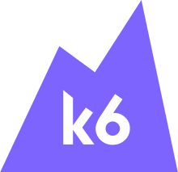

 

 
 

# k6 Cloud Feature Requests

Are you a [k6 Cloud](https://k6.io/) customer, or contemplating becoming one, and have an idea of how the product could be improved? Then you've come to the right place. In this repo you can suggest, discuss and vote for ideas that you'd like to see implemented in k6 Cloud.

## How do I suggest an idea?

Well, that's easy, just open an [issue](/k6io/cloud-feature-requests/issues) and try to apply the appropriate labels to your issue. Well, after first searching to see if there's an open issue covering your idea.

A k6 employee, typically from the product team, will acknowlegde your issue as soon as possible, typically within 24h during regular week days.

## Will my idea be implemented?

Maybe, maybe not. We can't promise we'll agree your idea is a good fit for our roadmap, but we'll always try to understand your use case and offer any workarounds that might exists.

If we do agree that your idea fits within our roadmap we'll put it through our prioritization process where we weigh different ideas against each other to decide which ones we want to bet on as the most important for the current product implementation cycle (8 week period).

Once your idea is slotted in for implementation in a cycle we'll add the `in progress` label to the issue and add a comment in the issue that the implementation has started. Then you just wait, for at most 8 weeks.

## How do I vote for an existing idea?

Just add a thumbs up :thumbsup: reaction to the issue you want to see implemented. We in the product team will use that to gauge the relative interest of ideas.
